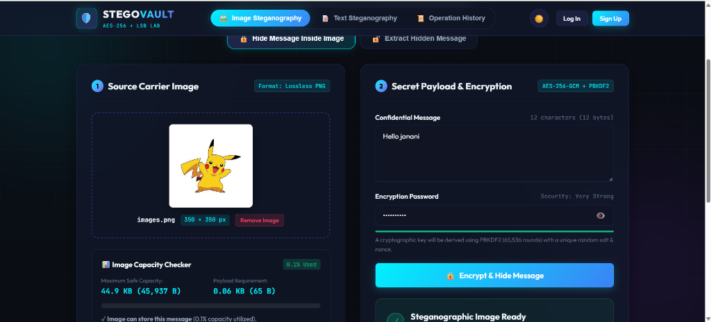
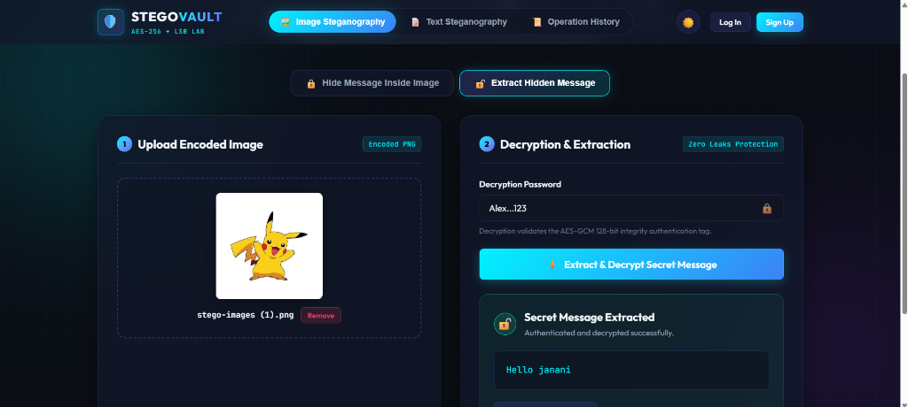
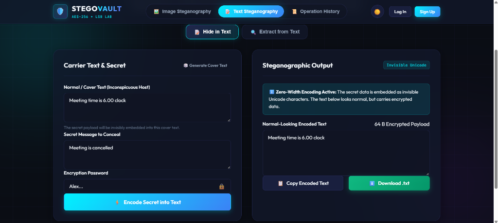
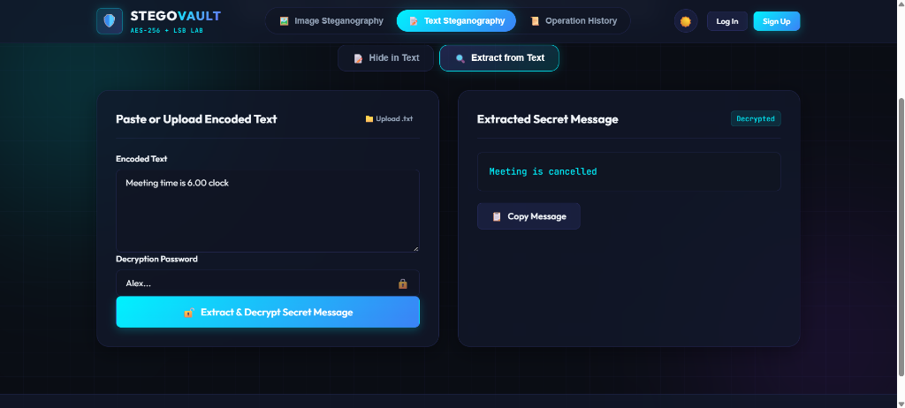

# 🛡️ StegoVault: Secret Message Encoder & Decoder

[](https://www.oracle.com/java/)
[](https://spring.io/projects/spring-boot)
[](https://en.wikipedia.org/wiki/Galois/Counter_Mode)
[]()
[]()

> A full-stack, military-grade steganography and cryptographic laboratory built with **Java 21**, **Spring Boot 3.4**, **Spring Security**, **Spring Data JPA**, **MySQL / H2**, and a responsive cybersecurity-themed single-page frontend.

🌐 **Live Web App (GitHub Pages)**: [https://janani-v219.github.io/Stego_Vault/](https://janani-v219.github.io/Stego_Vault/)  
⚡ **Alternative Netlify Mirror**: [https://beamish-cuchufli-3ad51f.netlify.app](https://beamish-cuchufli-3ad51f.netlify.app) *(Password: `My-Drop-Site`)*  
📦 **GitHub Repository**: [https://github.com/Janani-V219/Stego_Vault](https://github.com/Janani-V219/Stego_Vault)

---

## 📸 Visual Demonstrations & Screenshots

### 🖼️ 1. Image Steganography (Hide & Extract Message)
| Hide Message Inside Image | Extract Hidden Message |
| :---: | :---: |
|  |  |

### 📝 2. Text Steganography (Unicode Zero-Width Encoding)
| Conceal Secret in Normal Text | Extract & Decrypt Secret Message |
| :---: | :---: |
|  |  |

---

## 📖 Table of Contents
- [Project Overview](#-project-overview)
- [Architecture & Tech Stack](#-architecture--tech-stack)
- [Core Algorithms & Cryptography](#-core-algorithms--cryptography)
  - [1. Image Steganography (LSB)](#1-image-steganography-lsb)
  - [2. Text Steganography (Zero-Width Unicode)](#2-text-steganography-zero-width-unicode)
  - [3. Cryptographic Pipeline (AES-256-GCM + PBKDF2)](#3-cryptographic-pipeline-aes-256-gcm--pbkdf2)
- [Key Features](#-key-features)
- [Database Design](#-database-design)
- [REST API Documentation](#-rest-api-documentation)
- [Getting Started](#-getting-started)
  - [Prerequisites](#prerequisites)
  - [Running with Default In-Memory Database (Zero-Setup)](#running-with-default-in-memory-database-zero-setup)
  - [Running with MySQL (Production Profile)](#running-with-mysql-production-profile)
  - [Running Automated Tests](#running-automated-tests)
- [Security & Compliance Highlights](#-security--compliance-highlights)
- [Future Enhancements](#-future-enhancements)

---

## 🌟 Project Overview

StegoVault enables users to securely conceal and communicate sensitive information across two primary media:
1. **🖼️ Image Steganography**: Embeds AES-256-GCM encrypted binary payloads directly into the least significant bits (LSB) of PNG image pixels. The resulting image looks completely indistinguishable from the original carrier to the human eye.
2. **📝 Text Steganography**: Conceals encrypted payloads inside ordinary host sentences using non-printing, invisible Unicode Zero-Width characters (`\u200B`, `\u200C`, `\u200D`, `\uFEFF`). The carrier text looks and reads completely normal.

---

## 🛠️ Architecture & Tech Stack

```text
┌───────────────────────────────────────────────────────────────┐
│                    Frontend Client (SPA)                      │
│   HTML5 • Vanilla CSS3 (Cyber Aesthetic) • JavaScript ES6+   │
│       Theme Switcher • Drag & Drop • Live Capacity Meter      │
└───────────────────────────────┬───────────────────────────────┘
                                │ JSON / Multipart HTTP REST
                                ▼
┌───────────────────────────────────────────────────────────────┐
│                  Spring Boot 3.4 REST Layer                   │
│   AuthController • ImageStegoController • TextStegoController │
│               HistoryController • CapacityController          │
├───────────────────────────────────────────────────────────────┤
│                     Security & Auth Filter                    │
│   Spring Security • JWT Authentication (HMAC-SHA) • BCrypt    │
├───────────────────────────────────────────────────────────────┤
│                     Business & Stego Engine                   │
│   ImageSteganographyService (LSB) • TextSteganographyService  │
│          AesGcmEncryptionService (AES-256-GCM + PBKDF2)        │
├───────────────────────────────────────────────────────────────┤
│                   Data Persistence (Spring JPA)               │
│      UserRepository • EncodingHistoryRepository (Zero-Leaks)  │
└───────────────────────────────┬───────────────────────────────┘
                                │
                                ▼
           ┌─────────────────────────────────────────┐
           │ MySQL 8.0+ (Prod) / H2 In-Memory (Dev)  │
           └─────────────────────────────────────────┘
```

### Backend
* **Java**: 21 LTS
* **Framework**: Spring Boot 3.4.3
* **Security**: Spring Security 6 with stateless JWT (`io.jsonwebtoken:jjwt:0.12.6`)
* **ORM**: Spring Data JPA / Hibernate 6
* **Database**: MySQL 8.0+ connector with zero-config H2 embedded database fallback
* **Build System**: Apache Maven

### Frontend
* Pure Vanilla HTML5, CSS3, and JavaScript (ES6+ Fetch API)
* Cybersecurity-themed UI (Cyber Cyan `#00f2fe`, Deep Violet, Emerald Green)
* Dark Mode (default) with Light Mode toggle
* Drag-and-drop file upload with animated scanner dropzone
* Interactive live Image Capacity Calculator
* Toast notification alerts and responsive mobile layout

---

## 🧠 Core Algorithms & Cryptography

### 1. Image Steganography (LSB)
The application utilizes Least Significant Bit (LSB) steganography on lossless PNG images:
* Each pixel consists of Red, Green, Blue, and Alpha (RGBA) channels.
* StegoVault preserves the Alpha channel intact and modifies the lowest bit of the Red, Green, and Blue channels (3 bits stored per pixel).
* **Maximum Capacity Formula**:
  $$\text{Capacity (Bytes)} = \left\lfloor \frac{\text{Width} \times \text{Height} \times 3}{8} \right\rfloor$$
* **Binary Envelope Structure**:
  ```text
  [MAGIC (4B: 'STEG')] + [VERSION (1B: 0x01)] + [SALT (16B)] + [IV (12B)] + [CIPHERTEXT_LEN (4B)] + [CIPHERTEXT + 16B GCM TAG]
  ```

### 2. Text Steganography (Zero-Width Unicode)
* Encrypts the secret message with password-derived AES-256-GCM.
* Converts the packed binary stream into invisible Unicode zero-width characters:
  - `\u200B` (Zero-Width Space) represents binary `0`
  - `\u200C` (Zero-Width Non-Joiner) represents binary `1`
  - `\u200D` (Zero-Width Joiner) marks payload start
  - `\uFEFF` (Zero-Width No-Break Space) marks payload termination
* Invisibly embeds this character sequence into ordinary cover sentences.

### 3. Cryptographic Pipeline (AES-256-GCM + PBKDF2)
* **Key Derivation**: `PBKDF2WithHmacSHA256` using 65,536 iterations and a cryptographically secure 16-byte random salt generated per encryption.
* **Authenticated Encryption**: `AES/GCM/NoPadding` (256-bit key) with a 12-byte random IV/nonce and a 128-bit authentication tag.
* **Tamper Protection**: Any tampering with pixels, characters, or password entry causes AEAD tag verification failure, throwing a clean generic exception: `"Unable to decrypt the hidden message."` without leaking partial password validity.

---

## ✨ Key Features

1. **User Authentication & Authorization**:
   - Secure registration with client and server email format validation and password complexity enforcement (min 8 characters, letters + digits).
   - BCrypt hashing for account credentials (work factor 10).
   - Stateless JWT tokens passed via `Authorization: Bearer <token>` headers.
2. **Interactive Image Capacity Meter**:
   - Real-time pre-flight capacity evaluation as users upload images or type messages.
   - Shows Maximum KB, Payload requirement KB, and percentage bar (green < 85%, amber 85-100%, red > 100%).
3. **Image Steganography Engine**:
   - Lossless PNG encoding with instant browser preview, SHA-256 integrity, and download.
   - Secure decoding with one-click copy to clipboard.
4. **Text Steganography Engine**:
   - Built-in "Generate Cover Text" button for realistic cover phrases.
   - One-click copy, download as `.txt`, and upload `.txt`.
5. **Privacy-Preserving Audit History**:
   - Authenticated users automatically have their operations logged (operation type, filename, date, status).
   - **Strict Zero-Knowledge Guarantee**: Secret messages and encryption passwords are **never** stored in the database or logged.
   - Users can only view and delete their own history records.

---

## 🗄️ Database Design

### Entity Relationship
```text
┌───────────────────────────┐         1 : N         ┌───────────────────────────┐
│           User            │ ────────────────────< │      EncodingHistory      │
├───────────────────────────┤                       ├───────────────────────────┤
│ id (PK, BIGINT)           │                       │ id (PK, BIGINT)           │
│ name (VARCHAR 100)        │                       │ operation_type (VARCHAR)  │
│ email (VARCHAR 150, UK)   │                       │ file_name (VARCHAR 255)   │
│ password (VARCHAR 255)    │                       │ file_type (VARCHAR 50)    │
│ created_at (TIMESTAMP)    │                       │ status (VARCHAR 50)       │
└───────────────────────────┘                       │ created_at (TIMESTAMP)    │
                                                    │ user_id (FK, BIGINT)      │
                                                    └───────────────────────────┘
```

> [!IMPORTANT]
> The database schema strictly excludes columns for secret messages and encryption passwords.

---

## 🌐 REST API Documentation

### Authentication APIs

| Method | Endpoint | Description | Auth Required |
|---|---|---|---|
| `POST` | `/api/auth/register` | Register new user account | No |
| `POST` | `/api/auth/login` | Authenticate and obtain JWT | No |
| `GET` | `/api/auth/me` | Fetch current user profile | Yes (Bearer) |

#### Register Request Body:
```json
{
  "name": "Special Agent Alex",
  "email": "alex@stegovault.io",
  "password": "AgentPassword123!",
  "confirmPassword": "AgentPassword123!"
}
```

### Image Steganography APIs

| Method | Endpoint | Content-Type | Description |
|---|---|---|---|
| `POST` | `/api/steganography/image/capacity` | `multipart/form-data` | Check safe capacity for PNG image |
| `POST` | `/api/steganography/image/encode` | `multipart/form-data` | Embed secret into PNG and return file stream |
| `POST` | `/api/steganography/image/decode` | `multipart/form-data` | Extract and decrypt secret message |

### Text Steganography APIs

| Method | Endpoint | Content-Type | Description |
|---|---|---|---|
| `POST` | `/api/steganography/text/encode` | `application/json` | Embed secret invisibly into cover text |
| `POST` | `/api/steganography/text/decode` | `application/json` | Extract secret from encoded text |

#### Text Encode Request:
```json
{
  "coverText": "The project sprint is proceeding on schedule.",
  "secretMessage": "Operation Delta: Meet at 0900 hrs.",
  "password": "SecretPassword123!"
}
```

### History APIs

| Method | Endpoint | Description | Auth Required |
|---|---|---|---|
| `GET` | `/api/history` | Retrieve authenticated user's history | Yes (Bearer) |
| `DELETE` | `/api/history/{id}` | Delete a history entry owned by user | Yes (Bearer) |

---

## 🚀 Getting Started

### Prerequisites
* **Java 21** LTS or higher (`java -version`)
* **Maven 3.8+** (A pre-configured portable Apache Maven installation is included in `apache-maven-3.9.6`)

### Running with Default In-Memory Database (Zero-Setup)
1. Launch the application:
   ```powershell
   .\apache-maven-3.9.6\bin\mvn.cmd spring-boot:run
   ```
2. Open your web browser and visit:
   ```text
   http://localhost:8080
   ```
3. An in-memory H2 database with MySQL syntax compatibility and H2 console (`/h2-console`) is active by default.

### Running with MySQL (Production Profile)
1. Ensure MySQL is running on port 3306.
2. Initialize the database schema:
   ```bash
   mysql -u root -p < src/main/resources/schema-mysql.sql
   ```
3. Run the application with the `mysql` profile:
   ```powershell
   .\apache-maven-3.9.6\bin\mvn.cmd spring-boot:run -Dspring-boot.run.profiles=mysql
   ```
   *(Optionally pass `-DDB_USER=root -DDB_PASSWORD=yourpassword`)*

### Running Automated Tests
Run the automated test suite (24 unit and integration tests covering cryptography, LSB manipulation, zero-width steganography, validation, and user security):
```powershell
.\apache-maven-3.9.6\bin\mvn.cmd test
```

---

## 🔒 Security & Compliance Highlights

* **AEAD Authentication Tag Verification**: Uses AES-GCM 128-bit authentication tags to prevent oracle attacks and bit-flipping tampering.
* **Cryptographic Salt & Nonce Uniqueness**: A new 16-byte salt and 12-byte IV are generated with `java.security.SecureRandom` for every encoded message.
* **Key Derivation Standards**: Keys are derived with PBKDF2 (65,536 iterations), making brute-force dictionary attacks computationally expensive.
* **Information Leak Prevention**: Decryption failures always return `"Unable to decrypt the hidden message."` without revealing whether the password was close or what stage failed.
* **Lossless PNG Strictness**: Rejects lossy formats (JPEG/WebP) whose compression algorithms destroy LSB data.
* **Strict Privacy By Design**: Secret messages and encryption passwords are never logged to console or persisted to any database table.

---

## 🔮 Future Enhancements
* ⏳ Expiring / Self-destructing secret messages
* 📱 QR-code based encrypted steganography exchange
* 🎵 Audio steganography (WAV / FLAC LSB encoding)
* 📄 PDF metadata and invisible stream steganography
* 📊 Statistical Chi-Square and RS-analysis Steganalysis detector
